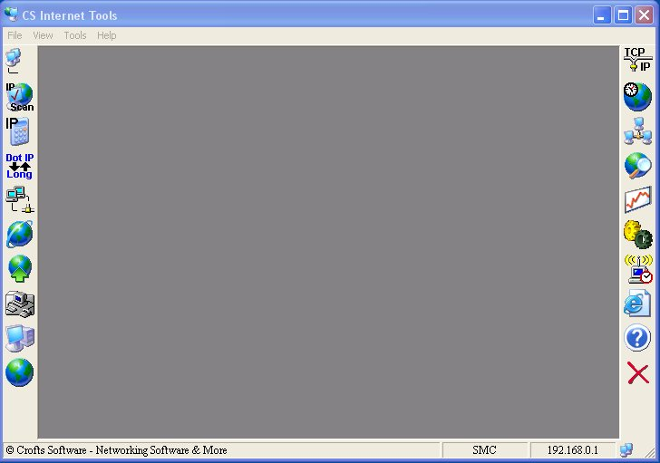



## CS Internet Tools 2\.0 \(15 tools, All API, NO DLL's or OCX's\)

### Description

This is the new version of my first CS Internet Tools. I sell a updated version of this program on my website, and it has been in 6 over-seas magazines and demo cds. I have had it for a while and decided it was time to share it. Vote if you like and I hope this program helps anyone who needs it. A lot of the tools that are in this program are close to 3x faster than the ones built into windows. Please let me know of any problems and enjoy yourself and happy codeing. If it wasnt for people sharing their code I wouldn't be the programmer I am today. I learn from others and then try to give back. Please, if you can, do the same. Bye! :-)
 
### More Info
 

             |
---                |---
**Submitted On**   |2002-08-31 02:32:58
**By**             |[Shane Croft](https://github.com/Planet-Source-Code/PSCIndex/blob/master/ByAuthor/shane-croft.md)
**Level**          |Advanced
**User Rating**    |5.0 (184 globes from 37 users)
**Compatibility**  |VB 6\.0
**Category**       |[Complete Applications](https://github.com/Planet-Source-Code/PSCIndex/blob/master/ByCategory/complete-applications__1-27.md)
**World**          |[Visual Basic](https://github.com/Planet-Source-Code/PSCIndex/blob/master/ByWorld/visual-basic.md)
**Archive File**   |[CS\_Interne12484783120\.zip](https://github.com/Planet-Source-Code/shane-croft-cs-internet-tools-2-0-15-tools-all-api-no-dll-s-or-ocx-s__1-38517/archive/master.zip)

